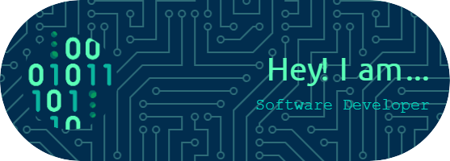

  

<h1 align="center">Hi 👋, I'm Evans Nyamu</h1>
<h3 align="center">Tech is in my DNA — I eat, sleep, and breathe code. Powered by coffee and clean commits, with 0s and 1s running through my veins, debugging is my cardio. I speak fluent API and was born to build, wired to innovate. I'm cloud-native, caffeine-fueled, and the terminal is my comfort zone. My love language? Version control</h3>
Connect with me:</h3>

<h3 align="left">Languages and Tools:</h3>

                                                         

# 💻 Tech Stack:
                                                                          
# 📊 GitHub Stats:
 
 

### ✍️ Random Dev Quote

---

<!-- Proudly created with GPRM ( https://gprm.itsvg.in ) -->
