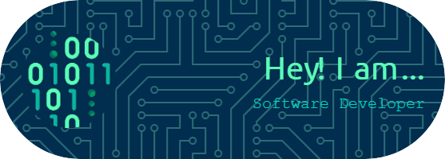

<!-- ===================================================== -->
<!--                 GITHUB PROFILE README                 -->
<!-- ===================================================== -->

<div align="center">



<br><br>


</div>

---

<h1 align="center">Hi 👋, I'm Evans Nyamu</h1>

<h3 align="center">
Tech is in my DNA — I build secure, scalable, and innovative systems across cloud engineering, cybersecurity, networking, DevOps, and software development.
</h3>

<br>


---

## 🚀 About Me

- 🔭 Currently working on **Machine Learning & Ethical Hacking**
- 🌱 Learning **Kubernetes, AI/ML, Data Science & Cloud Security**
- 🎓 BSc Computer Science — **Kenyatta University**
- 🛡️ Certified in **AWS, Cisco, IBM, Fortinet, ISC2 & Microsoft**
- 💡 Passionate about cybersecurity awareness and digital innovation in Kenya
- 👨‍💻 All of my projects are available on  
  👉 **https://github.com/evanssamwel**
- 💬 Ask me about **Cybersecurity, Cloud, Networking, Full Stack Development & DevOps**
- 📫 Reach me at: **snyamuevans@gmail.com**
- ⚡ Fun fact: The first computer "bug" was literally a moth 🐛 trapped inside the Harvard Mark II computer.

<br><br>

---

# 🌐 Connect With Me

<p align="center">

<a href="mailto:snyamuevans@gmail.com">

</a>

<a href="https://www.linkedin.com/in/evans-nyamu-184019189/">

</a>

<a href="https://github.com/evanssamwel">

</a>

</p>

---

# 💻 Tech Stack

<details open>
<summary><h3>☁️ Cloud & DevOps</h3></summary>

<br>

<p align="center">

<a href="https://aws.amazon.com">

</a>

<a href="https://azure.microsoft.com/">

</a>

<a href="https://cloud.google.com">

</a>

<a href="https://www.docker.com/">

</a>

<a href="https://kubernetes.io">

</a>

<a href="https://www.jenkins.io">

</a>

<a href="https://firebase.google.com/">

</a>

<a href="https://vercel.com">

</a>

</p>

</details>

---

<details>
<summary><h3>💻 Frontend Development</h3></summary>

<br>

<p align="center">

<a href="https://reactjs.org/">

</a>

<a href="https://angular.io">

</a>

<a href="https://vuejs.org/">

</a>

<a href="https://nextjs.org/">

</a>

<a href="https://tailwindcss.com/">

</a>

<a href="https://getbootstrap.com">

</a>

</p>

</details>

---

<details>
<summary><h3>⚙️ Backend Development</h3></summary>

<br>

<p align="center">

<a href="https://nodejs.org">

</a>

<a href="https://laravel.com/">

</a>

<a href="https://www.djangoproject.com/">

</a>

<a href="https://spring.io/">

</a>

<a href="https://expressjs.com">

</a>

<a href="https://www.php.net">

</a>

</p>

</details>

---

<details>
<summary><h3>🛡️ Cybersecurity & Networking</h3></summary>

<br>

<p align="center">

<a href="https://www.linux.org/">

</a>

<a href="https://www.gnu.org/software/bash/">

</a>

<a href="https://www.cisco.com/">

</a>

<a href="https://grafana.com">

</a>

<a href="https://www.postman.com">

</a>

</p>

</details>

---

<details>
<summary><h3>🧠 AI / Machine Learning</h3></summary>

<br>

<p align="center">

<a href="https://www.python.org">

</a>

<a href="https://pytorch.org/">

</a>

<a href="https://www.tensorflow.org">

</a>

<a href="https://pandas.pydata.org/">

</a>

<a href="https://numpy.org/">

</a>

</p>

</details>

---

# 🚀 Featured Projects

<table>

<tr>

<td width="50%">

<h3>🏥 Hospital ERP System</h3>

<p>
Comprehensive hospital ERP platform with patient management, billing, pharmacy, HR, reporting, and role-based access control.
</p>

<b>Tech Stack:</b>

Laravel • MySQL • Bootstrap • Docker

</td>

<td width="50%">

<h3>🔐 Police Record Management System</h3>

<p>
Secure records management platform with authentication, role permissions, data management, and reporting features.
</p>

<b>Tech Stack:</b>

PHP • JavaScript • MySQL

</td>

</tr>

<tr>

<td width="50%">

<h3>🛒 E-Commerce Platform</h3>

<p>
Full-stack e-commerce application with product management, authentication, payments, and responsive UI.
</p>

<b>Tech Stack:</b>

Django • PostgreSQL • React

</td>

<td width="50%">

<h3>📅 Timetable Generator</h3>

<p>
Automated timetable generation system with scheduling logic and optimization features.
</p>

<b>Tech Stack:</b>

JavaScript • PHP • CSS

</td>

</tr>

</table>

---

# 🏆 Certifications

<p align="center">


</p>

---

# 📊 GitHub Stats

<div align="center">


</div>

<br>

<div align="center">


</div>

---

# 📈 Contribution Graph

<p align="center">


</p>

---

# 🏆 GitHub Trophies

<p align="center">


</p>

---

# 🐍 Contribution Snake

<p align="center">


</p>

---

# ✨ Random Dev Quote

<p align="center">


</p>

---

<div align="center">

### ⚡ "Secure systems. Scalable solutions. Continuous innovation."


</div>
```
